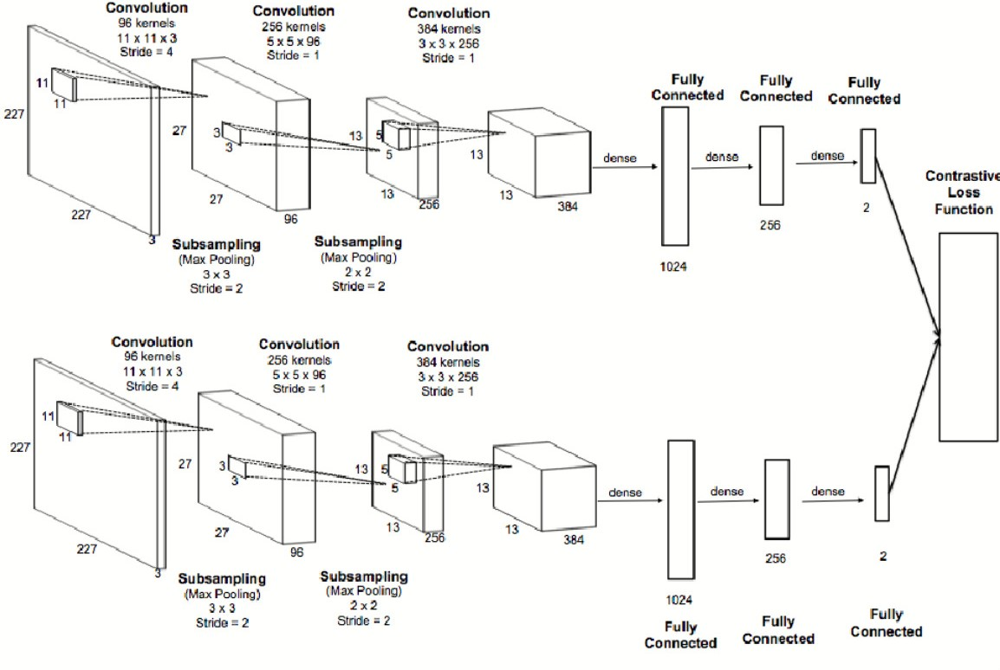
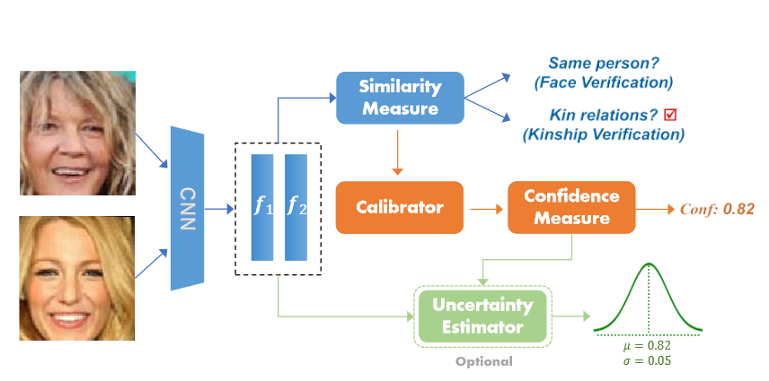
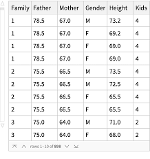
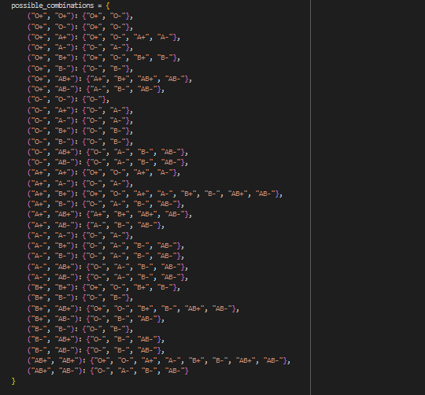

 BRIDGING GENES AND PIXELS TO UNVEIL GENETIC CONNECTIONS

TABLE OF CONTENTS

| NAME | Fingerprint | Model Deployment | Facial Features | Skin Tone | Web Development | Height | Eyes | Blood |
| :-: | :-: | :-: | :-: | :-: | :-: | :-: | :-: | :-: |
| Omer Jouhar | ✅ | ✅ | ✅ |  | ✅ |  |  |  |
| Mubeen Ali shah |  |  |  |  |  |  | ✅ |  |
| Muhammad Nauman |  |  |  |  |  | ✅ |  | ✅ |
| Ammar Chattha |  |  | ✅ |  |  |  |  |  |
| Zainab |  |  | ✅ |  |  |  |  |  |
| Munazah |  |  | ✅ |  |  |  |  |  |
| Saad Ali |  | ✅ |  |  | ✅ |  | ✅ |  |
| Mawiya Kaleem |  |  |  | ✅ |  |  |  |  |
| Ahad Malik |  |  |  | ✅ |  |  |  |  |
| Asad Mehmood |  |  |  |  |  |  | ✅ |  |
| Hassan Ahmad |  |  |  |  |  | ✅ |  | ✅ |

__DATASET__

__\.__  1200 Dpi\, 512 by 512 necessary image processing applied

__\.__   Data augmentation techniques have been applied to enhance positive images through rotation and image mirroring approaches\. Additionally\, for the negative class\, random pairing of fingerprint data points has been implemented\.

__REFRENCES__

__\.__  Maiti\, D\.\, Basak\, M\.\, & Das\, D\. \(2023\)\. Quality and Feature Analysis of Parent and Child Fingerprints in West Bengal\, India\. International Journal for Research in Applied Science & Engineering Technology \(IJRASET\)\, 11\(X\)\, 127\.

__\.__  Aigbogun Jr\.\, E\. O\.\, Ibeachu\, C\. P\.\, & Lemuel\, A\. M\. \(2019\)\. Fingerprint pattern similarity: a family\-based study using novel classification\. Anatomy\, doi:10\.2399/ana\.19\.065\.

__APPROACH__

__\.__   A Siamese neural network has been implemented using constructive loss function with PyTorch\. A convolutional neural network \(CNN\) employed to create the feature vector\.

__DATASET__

__  __  __KinFaceW__  __\-I \, __  __KinFaceW__  __\-II __

__	__  __\. __ Introduced by Lu et al\. in Min Xu\, Ximiao Zhang\, Xiuzhuang Zhou

__\. __ KinFaceW\-I dataset contains 533 pairs of facial images of persons with a kin relation\. Four different kin relations are considered in the dataset: father and daughter \(F\-D\) with 134 pairs\, father and son \(F\-S\) with 156 pairs\, mother and daughter \(M\-D\) with 127 pairs\, mother and son \(M\-S\) with 116 pairs\. Each sample is composed of one parent face image and one child face image\.

__\. __ KinFaceW\-II Dataset consists of 1000 pairs of facial images of individuals with a kin relation\. This database also considers four common kin relations: father and daughter \(F\-D\)\, father and son \(F\-S\)\, mother and daughter \(M\-D\)\, mother and son \(M\-S\)\. Different from the KinFaceW\-I database\, the positive pairs in this dataset are taken from the same photo\.

__REFRENCES__

__	__  __\.__  M\. Xu\, X\. Zhang and X\. Zhou\, "Confidence\-Calibrated Face and Kinship Verification\," in IEEE Transactions on Information Forensics and Security\, vol\. 19\, pp\. 372\-384\, 2024\, doi: 10\.1109/TIFS\.2023\.3318957\.

__APPROACH__

__	__ In this we addresses the challenge of confidence estimation in face and kinship verification\, crucial for ensuring reliability and trustworthiness in high\-stakes scenarios\. While existing methods primarily focus on accuracy\, neglecting confidence estimation can lead to unreliable predictions\. To tackle this issue\, we propose an effective confidence measure to convert similarity scores into confidence scores for face pairs\. Additionally\, we introduce Angular Scaling Calibration \(ASC\)\, a simple yet powerful technique that enables existing verification models to generate confidence\-calibrated predictions without requiring model modifications\. Furthermore\, we incorporate uncertainty estimation into the calibrated confidence to enhance model reliability in noisy data settings\. Our approach represents a comprehensive solution for confidence\-calibrated face and kinship verification\, as validated through extensive experiments on four benchmark datasets\. The results demonstrate the efficacy of our proposed method\.

__DATASET__

__	\.__  __ __ Galton height dataset

__APPROACH__

__	\. __ In the project\, neural network regression was employed to forecast child height using parental height as input\. The accuracy of the predictions was evaluated by comparing the forecasted child height with actual measurements\. Results within a range of ±2 units were considered acceptable\, demonstrating the efficacy of the predictive model\.

__DATASET__

__	__  __\.__  __ __ Manual insertion of dataset in code

__APPROACH__

__\.__  __ __ Here\, we've employed an approach wherein the provided dataset indicates that certain blood group combinations from parents yield specific blood group outputs in their offspring\. Initially\, we'll consider the blood groups of the parents\, and subsequently\, those of their child\. We'll then determine from the dataset whether these blood group combinations align with our anticipated outcomes\.

Skintone   Recognition

* __DATASET__
* __\.__  The dataset used is of 200\,000 and was refrenced from https://mmlab\.ie\.cuhk\.edu\.hk/projects/CelebA\.html
    * Necessary data augmentations were done like alignment of the pictures\, cropping the images in the same sizes and only using \.jpg format  of data\.
* __REFRENCES__
* __\.__  IEEE Signal Process\. Lett\.\, 24 \(3\) \(2017\) \, Shakir H\.R\.\, George L\.E\.\, Tuama G\.K 2015 \,
* __\.__  Multimodal approach to human\-face detection and tracking IEEE Trans\. Ind\. Electron\.\, 55 \(3\) \(2008\)
* __\.__  A comparative assessment of pixel\-based skin detection methods GML Comput\. Vis\. Group \(2005\)
* __APPROACH__
* __\.__  In the image processing notebook We used the original CelebA dataset\. It extracts face images using the MTCNN face detection pre\-trained model\, combines them\, and prepares the dataset for skin tone classification\.
    * The skin tone classification notebook uses the processed face images to classify them based on three predefined skin tones: Fair/Light\, Medium/Tan\, and Dark/Deep\. The MobileNetV2 model is employed for this classification task\.

Face  Detection

MTCNN

Skintone   Recognition

__MobileNetV2__

__model for__

__classification__  __ __

Input images

Parent and child

Skin\-tone                Detection

__Evaluating the __

__model's performance & saving it for deployment__

__Extracting__

__and saving __

__the Detected__

__face images__

Face Detection

Output likelihood of

Similar Skin tones

